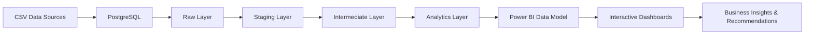

# Pathao-Business-Performance-Analytics

#  Pathao Ride-Sharing Business Intelligence Dashboard

### End-to-End Business Intelligence Solution

PostgreSQL | SQL |Power BI | DAX | Business Intelligence | Data Engineering

##### Transforming ride-sharing operational data into actionable business intelligence through modern data engineering, dimensional modeling, and executive analytics.

### Business Problem

Ride-sharing platforms generate thousands of operational records every day. Without an integrated analytics platform, stakeholders struggle to identify revenue trends, understand customer behavior, optimize driver utilization, reduce cancellations, and make informed strategic decisions.This project addresses these challenges by transforming raw ride-sharing data into executive-ready dashboards that enable data-driven operational and strategic decision-making.

### Business Objectives

* Monitor Revenue Performance

* Analyze Demand Patterns

* Reduce Cancellation Risk

* Improve Driver Productivity

* Measure Customer Retention

* Support Executive Decisions

### End-to-End Analytics Workflow

### PostgreSQL Data Engineering

| Layer        | Description                                    |
| ------------ | ---------------------------------------------- |
| Raw          | Source ride-sharing datasets                   |
| Staging      | Cleaning, profiling, validation                |
| Intermediate | Business transformations & feature engineering |
| Analytics    | Reporting-ready dimensional tables             |

#### SQL Tasks Performed

* Data Profiling

* Data Cleaning

* Duplicate Detection

* Data Validation

* Missing Value Handling

* Feature Engineering

* Business Rule Validation

* SQL Views

* Multi-layer Architecture

### Power BI Data Model

##### The analytical model follows a star schema consisting of one centralized fact table connected to customer, driver, date, and time dimensions, enabling scalable analytical queries and efficient report performance.

###  Dashboard Walkthrough

##### The dashboard is organized into seven analytical modules, each designed to answer specific business questions and support data-driven decision-making across executive, operational, customer, and revenue perspectives.

#### 01. Executive Overview

#### Business Questions
*How is overall business performance changing?
*What are the current operational KPIs?
*Which customer segments contribute the most revenue?
#### Key Insights
*Revenue decreased compared with the previous period.
*Premium customers generated most of the revenue.
*Peak-hour demand drives operational pressure.
#### Business Value
Provides executives with an overall health check of business performance.

#### Demand & Supply

