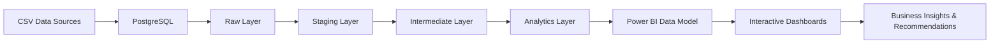

# Pathao-Business-Performance-Analytics

#  Pathao Ride-Sharing Business Intelligence Dashboard

### End-to-End Business Intelligence Solution

PostgreSQL | SQL |Power BI | DAX | Business Intelligence | Data Engineering

##### Transforming ride-sharing operational data into actionable business intelligence through modern data engineering, dimensional modeling, and executive analytics.

### Business Problem

Ride-sharing platforms generate thousands of operational records every day. Without an integrated analytics platform, stakeholders struggle to identify revenue trends, understand customer behavior, optimize driver utilization, reduce cancellations, and make informed strategic decisions.This project addresses these challenges by transforming raw ride-sharing data into executive-ready dashboards that enable data-driven operational and strategic decision-making.

### Business Objectives

* Monitor Revenue Performance

* Analyze Demand Patterns

* Reduce Cancellation Risk

* Improve Driver Productivity

* Measure Customer Retention

* Support Executive Decisions

### End-to-End Analytics Workflow

### PostgreSQL Data Engineering

| Layer        | Description                                    |
| ------------ | ---------------------------------------------- |
| Raw          | Source ride-sharing datasets                   |
| Staging      | Cleaning, profiling, validation                |
| Intermediate | Business transformations & feature engineering |
| Analytics    | Reporting-ready dimensional tables             |

#### SQL Tasks Performed

* Data Profiling

* Data Cleaning

* Duplicate Detection

* Data Validation

* Missing Value Handling

* Feature Engineering

* Business Rule Validation

* SQL Views

* Multi-layer Architecture

### Power BI Data Model

##### The analytical model follows a star schema consisting of one centralized fact table connected to customer, driver, date, and time dimensions, enabling scalable analytical queries and efficient report performance.

###  Dashboard Walkthrough

##### The dashboard is organized into seven analytical modules, each designed to answer specific business questions and support data-driven decision-making across executive, operational, customer, and revenue perspectives.

#### 01. Executive Overview

#### Business Questions

* How is overall business performance changing?

* What are the current operational KPIs?

* Which customer segments contribute the most revenue?

#### Key Insights

* Revenue decreased compared with the previous period.

* Premium customers generated most of the revenue.

* Peak-hour demand drives operational pressure.

#### Business Value
Provides executives with an overall health check of business performance.

#### 02.Demand & Supply

#### Business Questions

* When does demand peak?

* Are drivers sufficient during peak hours?

* Which locations experience the highest demand?

#### Key Insights

* Morning and evening hours experience the highest demand.

* Supply gaps increase during peak periods.

* Certain locations consistently experience higher ride requests.
#### Business Value
Supports workforce planning and driver allocation.

#### 03.Cancellation Analysis

#### Business Questions
* Why are rides cancelled?

* When do cancellations occur?

* Which vehicle type is most affected?
#### Key Insights
* Peak-hour periods produce the highest cancellation rates.

* Bike services experience higher hourly cancellation variability.

* Revenue loss is concentrated during operational bottlenecks.

#### Business Value
Supports operational improvements that reduce lost revenue.

#### 04.Revenue & Pricing

#### Business Questions
* Is pricing consistent?

* Which vehicle contributes most revenue?

* Which hours maximize profitability?
#### Key Insights
* Revenue generally increases with trip distance.

* Vehicle types contribute differently to overall revenue.

* Certain hours generate disproportionately high revenue.

#### Business Value
Supports pricing optimization and revenue management.

#### 05.Driver Performance

#### Business Questions
* Which drivers perform best?

* Is workload evenly distributed?

* How does revenue vary by driver?

#### Key Insights
* Driver productivity varies significantly.

* High-performing drivers consistently generate higher revenue.

* Operational clusters identify performance differences.
#### Business Value
Supports performance evaluation and incentive planning.

#### 06.Customer Retention & Behavioural Analytics

#### Business Questions
* Are customers returning?

* Which customers generate the greatest value?

* How strong is long-term retention?
#### Key Insights
* Customer retention declines across successive cohorts.

* Premium customers contribute greater lifetime value.

* Repeat customers remain a significant growth opportunity.
#### Business Value
Supports customer loyalty and retention strategies.

#### Executive Insights & Recommandations

#### Strategic Findings
* Revenue growth is constrained by declining trip volume.

* Peak-hour demand increases operational risk.

* Customer retention remains a key growth opportunity.

 | Business Problem   | Recommendation                      | Expected Impact        |
| ------------------ | ----------------------------------- | ---------------------- |
| High cancellations | Improve peak-hour driver allocation | Higher completion rate |
| Revenue decline    | Dynamic pricing optimization        | Increased revenue      |
| Low retention      | Customer loyalty campaigns          | Higher lifetime value  |

#### Business Value Delivered

| Business Area | Value Delivered              |
| ------------- | ---------------------------- |
| Revenue       | Revenue trend monitoring     |
| Operations    | Demand & supply optimization |
| Drivers       | Productivity benchmarking    |
| Customers     | Retention & CLV analysis     |
| Pricing       | Revenue efficiency analysis  |
| Executives    | Strategic decision support   |

#### Technical Skills Demonstrated

✓ PostgreSQL

✓ SQL

✓ Layered Data Architecture

✓ Data Profiling

✓ Data Validation

✓ ETL Concepts

✓ Dimensional Modeling

✓ Star Schema

✓ Power BI

✓ Advanced DAX

✓ Time Intelligence

✓ Cohort Analysis

✓ Customer Lifetime Value

✓ Driver Analytics

✓ Executive Dashboard Design

✓ Business Intelligence

✓ Data Storytelling

#### Repository Structure

Ride-Sharing-Business-Analytics/

│

├── 📂 SQL/

│   ├── 📂 raw/

│   │   └── Raw data loading scripts

│   ├── 📂 staging/

│   │   └── Data cleaning, profiling & validation

│   ├── 📂 intermediate/

│   │   └── Business transformations & feature engineering

│   └── 📂 analytics/

│       └── Star schema & reporting-ready SQL objects

│
├── 📂 PowerBI/

│   └── 📄 Ride_Sharing_Business_Analytics.pbix

│

├── 📂 Documentation/

│   └── 📄 Ride_Sharing_Business_Report.pdf

│

├── 📂 assets/

│   ├── 🖼️ data_architecture_diagram.png

│   ├── 🖼️ powerbi_data_model.png

│   ├── 🖼️ dashboard_overview.png

│   ├── 🖼️ demand_supply_dashboard.png

│   ├── 🖼️ cancellation_analysis_dashboard.png

│   ├── 🖼️ revenue_pricing_dashboard.png

│   ├── 🖼️ driver_performance_dashboard.png

│   ├── 🖼️ customer_analytics_dashboard.png

│   └── 🖼️ executive_insights_dashboard.png

│

└── 📄 README.md
 
